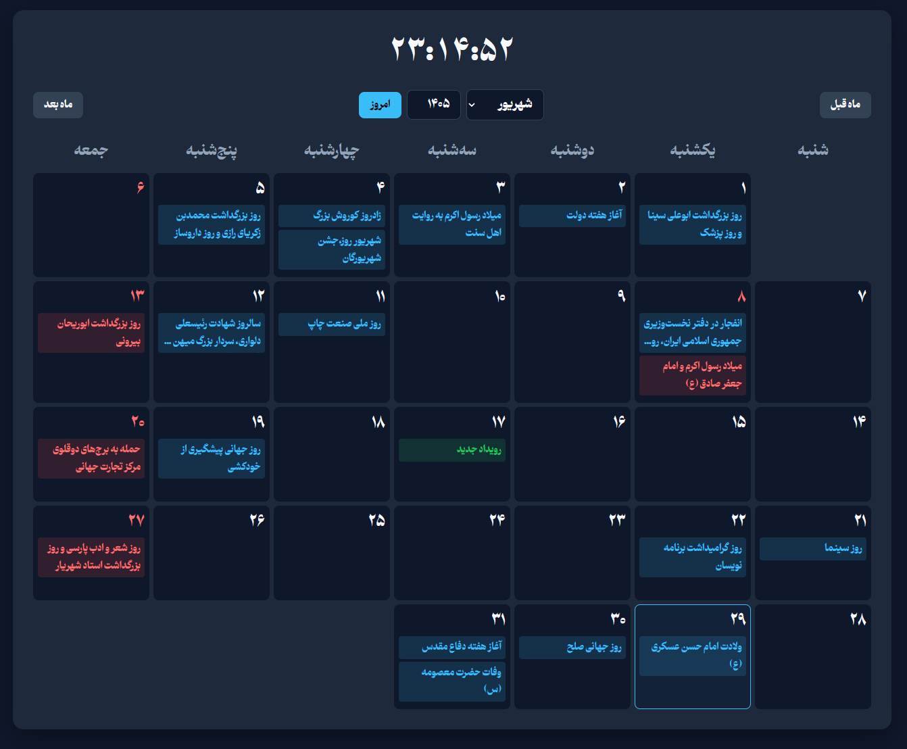
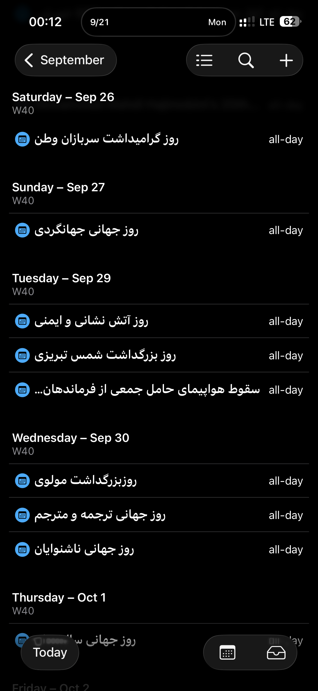
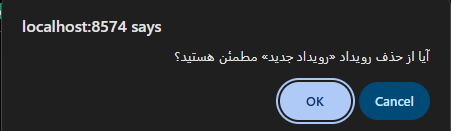
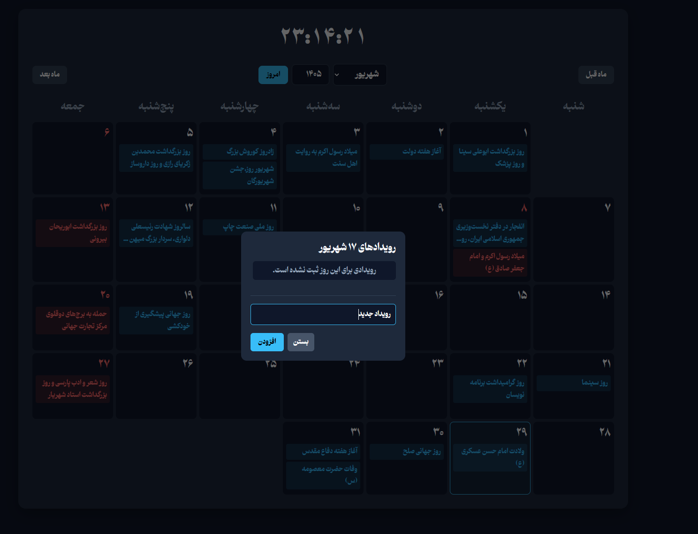
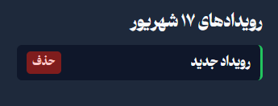
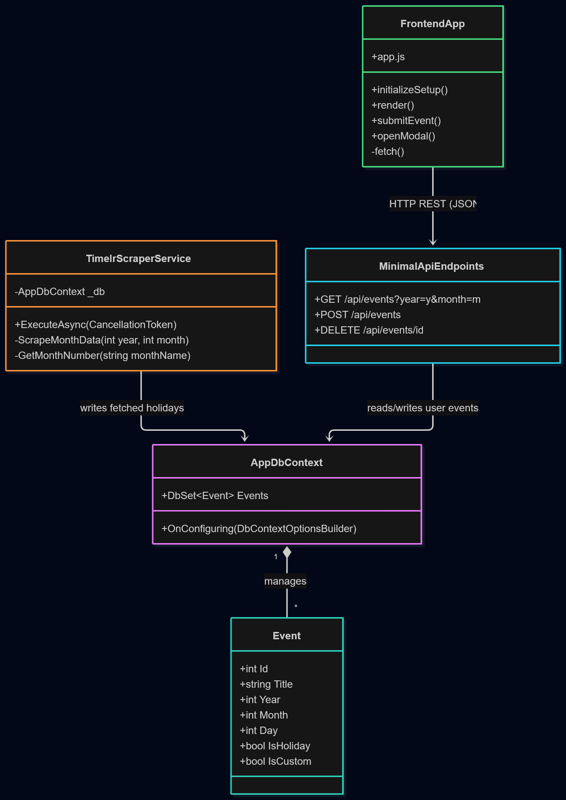

#  Docker Shamsi Calendar

A fast, lightweight, and modern Persian (Shamsi) Calendar application built with **ASP.NET Core Minimal APIs** and **Vanilla JavaScript**. Designed for easy deployment, this application features a sleek UI, custom event tracking, and an automated background scraper to fetch national holidays.




---

##  Features

* **Native Persian Dates:** Accurate Shamsi date calculations and leap year support.
* **Custom Event Management:** Add your own custom events directly to the calendar. Custom events are highlighted in **Green**, while Fridays and national holidays are marked in **Red**.
* **Native Mobile Sync (ICS):** Subscribe to your calendar feed directly from your iPhone (Apple Calendar) or any other standard calendar app.
* **Automated holiday synchronization:** Fetches official events from time.ir during application startup when the current year's events are not already present.
* **Built-in `HtmlAgilityPack`** scraper fetches official holidays directly from *time.ir* (fully supporting historical month names like "امرداد").
* **Persistent Storage:** Utilizes SQLite with Docker volume mapping to ensure your custom events are never lost between server restarts.
* **Responsive Design:** A custom CSS grid layout that looks perfect on desktop monitors, tablets, and mobile devices.
* **Docker Native:** Pre-configured `Dockerfile` and `compose.yml` for instant zero-config deployments on any Linux VPS or server management panel (like Dockhand).

---

##  Syncing with Your Phone

You can view all your custom events and holidays directly inside your native Apple Calendar or Google Calendar app. The server generates a live `.ics` feed that updates automatically.

**For iPhone (Apple Calendar):**
1. Open your iPhone **Settings**.
2. Tap **Calendar** > **Accounts** > **Add Account**.
3. Tap **Other**, then select **Add Subscribed Calendar**.
4. In the Server box, enter your live server URL: 
   `http://YOUR_SERVER_IP:8574/calendar.ics`
5. Tap **Next** and **Save**. 

*(Note: If prompted about SSL, tap **Yes** to continue without SSL).*

---

##  Application Previews

### Phone View



### Viewing Events


### Adding Custom Events


### Event Highlights


---

##  Tech Stack

**Backend:**
* C# / .NET 10.0
* ASP.NET Core Minimal APIs
* SQLite via Microsoft.Data.Sqlite
* HtmlAgilityPack (Web Scraping)

**Frontend:**
* HTML5
* CSS3 (Custom Variables, CSS Grid, Responsive Media Queries)
* Vanilla JavaScript (ES6+ async/await fetch API)

---

##  Getting Started

### Prerequisites
* [Docker Desktop](https://www.docker.com/products/docker-desktop) (for local testing) or a Docker-enabled server.
* [.NET 10.0 SDK](https://dotnet.microsoft.com/download) (if developing locally without Docker).

### Local Development (Visual Studio)
1. Clone the repository:
   ```bash
   git clone [https://github.com/Mabini-AIO/Docker-Shamsi-Calendar.git](https://github.com/Mabini-AIO/Docker-Shamsi-Calendar.git)

    Open Docker-Shamsi-Calendar.sln in Visual Studio.

    Ensure the launch profile is set to http (not Docker) to avoid port conflicts.

    Press F5 to run. The calendar will be available at http://localhost:8574.

Production Deployment (Docker Compose)

This project is configured to run on port 8574 out of the box.

    Clone the repository on your server:
    Bash

    git clone [https://github.com/YourUsername/Docker-Shamsi-Calendar.git](https://github.com/YourUsername/Docker-Shamsi-Calendar.git)
    cd Docker-Shamsi-Calendar

    Build and run the container in the background:
    Bash

    docker compose up -d --build

    Access your calendar at http://YOUR_SERVER_IP:8574.

 Architecture

 Project Structure

    /wwwroot/ - Contains all frontend assets (index.html, /css/style.css, /js/app.js, /fonts/).

    /Models/ - Database schemas and event classes.

    /Services/ - Background workers and the time.ir scraper logic.

    /Endpoints/ - Clean routing definitions for REST logic and ICS feeds.

    Program.cs - Core web application builder and service registration.

    Dockerfile - Multi-stage build instructions for compiling the .NET app.

    compose.yml - Docker stack configuration including volume mapping for the SQLite database.
